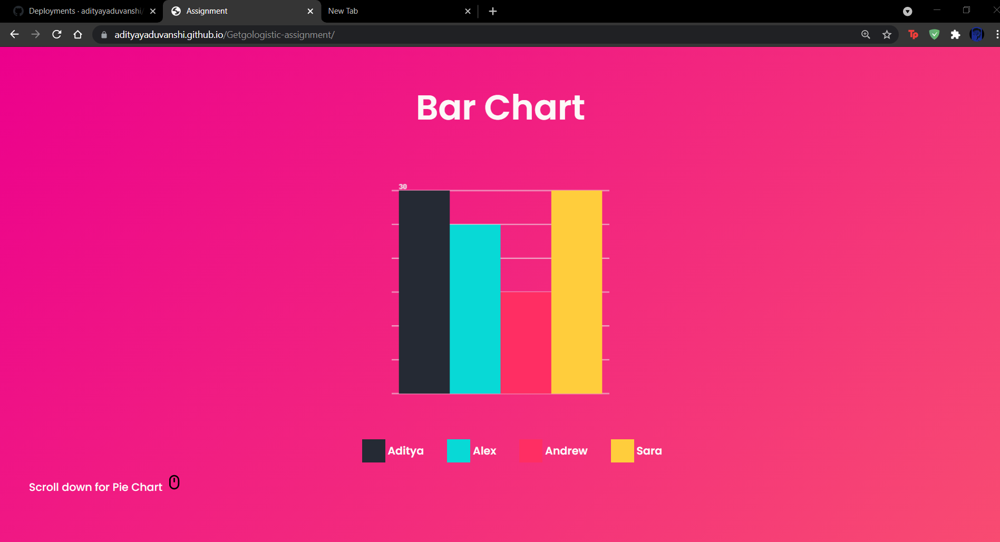
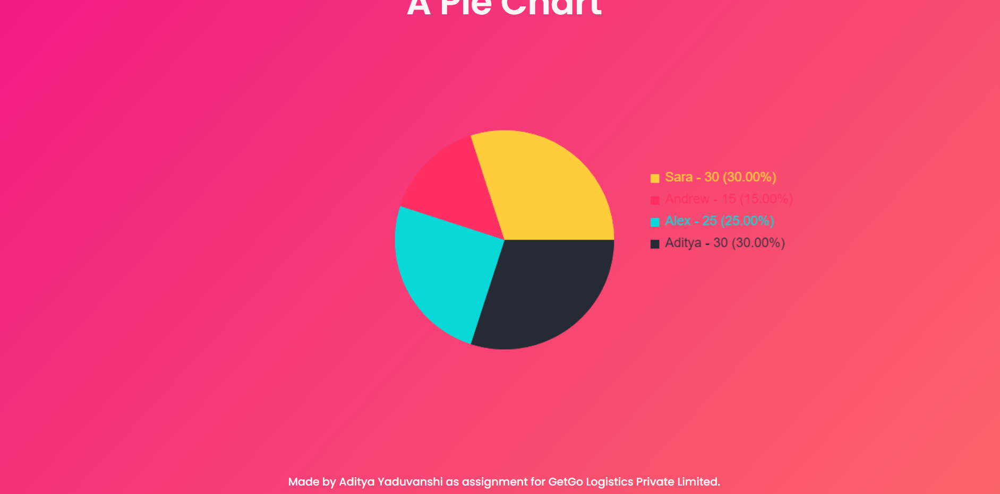

# Getgologistics-assignment

This is the assignment given by GetGoLogistics Private Limited. Task was to Create a Pie or Bar Chart for following details
<ul>
  <li> Don’t use any chart library</li>
 <li>Display 4 users with different colors</li>
  <li> Let say A has Rs 30, B has Rs 25, C has Rs 15 and D has Rs 30</li>
  </ul>
So i created both Bar Chart and Pie chart by using only Javascript(not any chart library).
I used some styling property to give better look.
 

## Live Demo
Link - https://adityayaduvanshi.github.io/Getgologistic-assignment/

## Screenshots 

## Contact me
<ul>
  <li>Created by --  Aditya Yaduvanshi</li>
  <li>Twitter -- <a href="https://twitter.com/fixslyr">Fixslyr</a>
    <li>Instagram -- <a href="https://www.instagram.com/imtheaddy/">Aditya Yaduvanshi</a>
      <li>Linkedin -- <a href="https://www.linkedin.com/in/theaditya-yaduvanshi-/">Aditya Yaduvanshi</a>
  </ul>    
